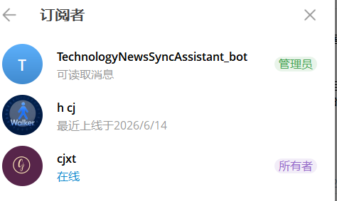
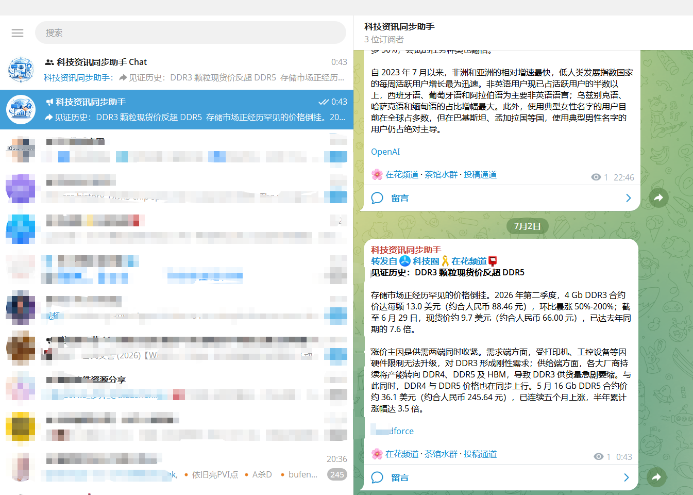
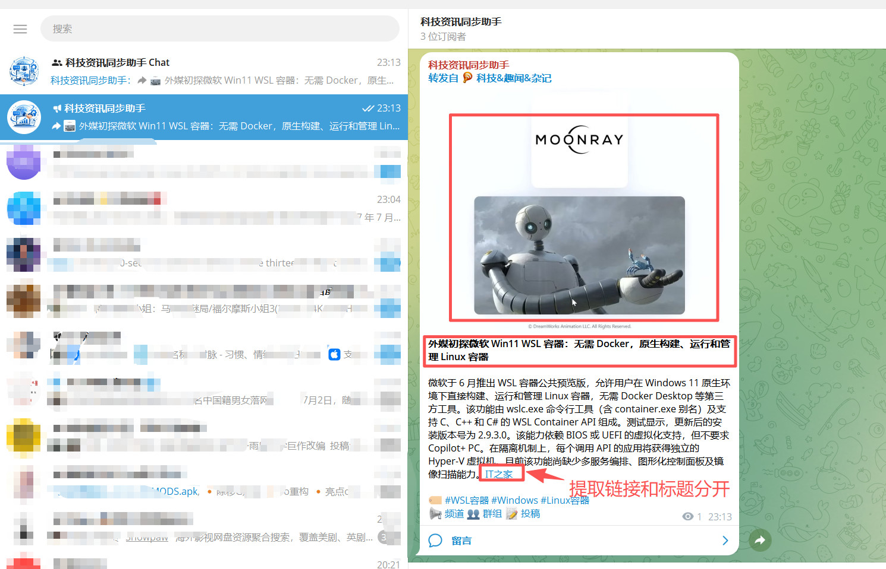
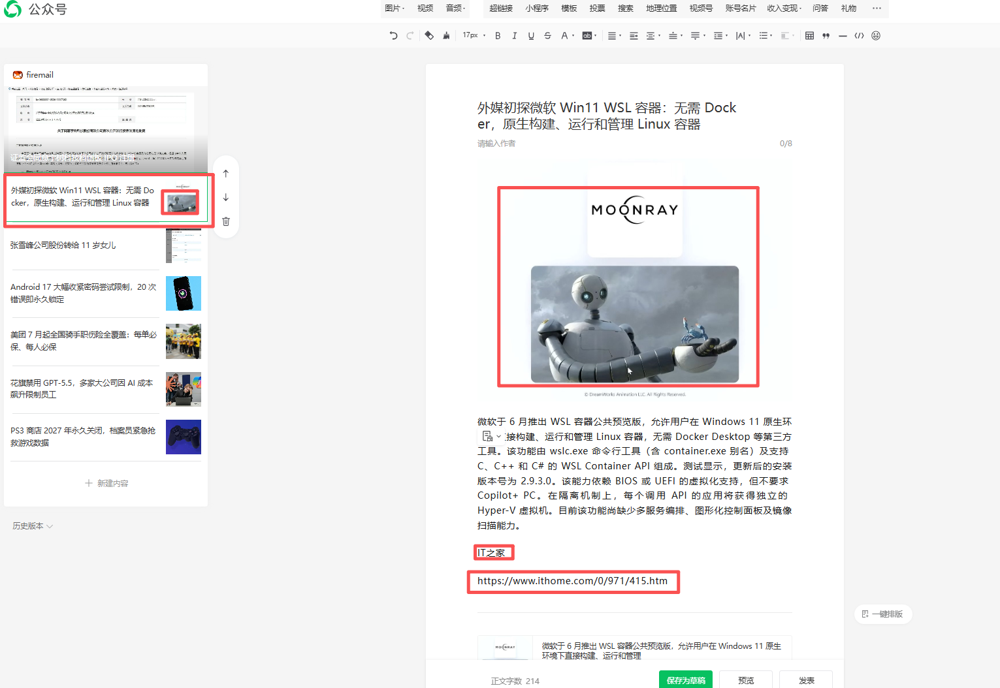

https://t.me/chengjinxuetang 账号 已开通了频道 https://t.me/TechnologyNewsSyncAssistant

做为消息的管理者 TechnologyNewsSyncAssistant_bot 需要采用自己发布到这个频道里的消息

已经安装 D:\ProgramFiles\Telegram\Telegram.exe  且已运行中，已登录了cjxt账号

这是频道的相关情况，也可以评估一下用什么方式采用最为方便，因为这里面发的消息是cjxt从其它频道里转过来的，但看窗口里也没显示是cjxt发过来的，而是直接以频道发布信息的方式展示

规则如下：

内容如下：

涉及到引用地址的，提取出 名称，地址 分开写

根据涉及到的引用或地址找到图片
下载图片，有视频要下载视频，按日期创建文件夹(如：E:\PerSourceCodeStore\github\chengjinxt\tgexporter\发布内容\20260711)，里面存放发面的每一篇文章的markdown文件和md文件对应引入的图片或视频，md文件、图片文件和视频文件都以相同步的前缀开头，方便同一个标题的内容按名称能排列在一起，如："OpenClaw 原生移动端上线 iOS 与 Android"这个标题的文章，对应的存放文件为 "20260701_001_OpenClaw 原生移动端上线 iOS 与 Android.md"   "20260701_001_pic_001_OpenClaw 原生移动端上线 iOS 与 Android.png"   "20260701_001_PIC_002_OpenClaw 原生移动端上线 iOS 与 Android.jpg"     "20260701_001_VID_002_OpenClaw 原生移动端上线 iOS 与 Android.mp4"  规则如下：年月日_今天第几篇文章_图片还是视频_这篇文章的第几个图片或视频_标题.图片或视频文件对应的后缀

转换过程：

tg频道 到  md 文档  到 公众号文章

